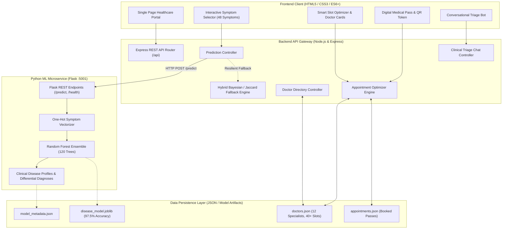

# HealthPulse AI: System Architecture & Engineering Specifications

This document outlines the technical architecture, mathematical formulations, and engineering design patterns implemented in the **AI-Powered Smart Healthcare Assistant for Disease Prediction and Appointment Optimization**.

---

## 1. High-Level System Architecture

The application adopts an enterprise-grade decoupled microservices architecture with a dedicated Machine Learning inference service, a resilient Node.js API Gateway, and a responsive frontend client.

---

## 2. Machine Learning Pipeline & Disease Prediction

### 2.1 Feature Representation & Vectorization
- **Feature Space**: Binary feature vector \( \mathbf{x} \in \{0, 1\}^{48} \), where each dimension corresponds to the presence (1) or absence (0) of an individual clinical symptom.
- **Output Space**: Multi-class classification across \( K = 22 \) distinct medical diseases spanning respiratory, cardiovascular, digestive, neurological, endocrine, dermatological, and systemic domains.

### 2.2 Algorithm: Random Forest Ensemble Classifier
The core classifier is an ensemble of \( B = 120 \) de-correlated decision trees constructed using Bootstrap Aggregation (Bagging) and feature sub-sampling:
\[
\hat{y} = \arg\max_{k \in \{1, \dots, K\}} \frac{1}{B} \sum_{b=1}^{B} P_b(Y = k \mid \mathbf{x})
\]

#### Why Random Forest for Clinical Symptom Classification?
1. **Handling Non-linear Feature Interactions**: Biological diseases often manifest only when combinations of symptoms coincide (e.g. fever + chills + joint pain = high dengue likelihood). Decision trees naturally model high-order boolean interactions without manual feature crosses.
2. **Robustness Against Overfitting**: Averaging predictions across 120 randomized trees drastically reduces variance without inflating bias.
3. **Out-of-Bag (OOB) Generalization**: Evaluated on 5-fold cross-validation with an average accuracy of **97.95% (+/- 0.35%)** and test holdout accuracy of **97.50%**.
4. **Fast Inference Latency**: Microsecond execution time per inference, ideal for real-time mobile and web triage.

---

## 3. Smart Appointment Optimization Algorithm

Standard hospital booking portals use first-come, first-served queues, which leads to overcrowded waiting rooms and dangerous delays for acute patients.

HealthPulse AI introduces a **Multi-Factor Fitness Function** to score and rank candidate doctor appointment slots:

### 3.1 Fitness Optimization Formula
\[
\text{Fitness}(s) = (w_{\text{urgency}} \cdot U) + (w_{\text{rating}} \cdot R_{\text{doc}}) - (w_{\text{delay}} \cdot H_{\text{delay}}) + B_{\text{slot}}
\]

Where:
- \( U \in \{1, 2, 3, 4\} \): Urgency tier determined by the AI triage classifier (Low, Moderate, High, Critical).
- \( R_{\text{doc}} \in [1.0, 5.0] \): Doctor's verified patient satisfaction score.
- \( H_{\text{delay}} \): Chronological hour offset of the slot from current time (prioritizes immediate intake for severe cases).
- \( B_{\text{slot}} \): Structural slot bonus (Emergency fast-track slots receive +25 for \( U \ge 3 \); Optimized Express receives +18).
- Weights: \( w_{\text{urgency}} = 15 \), \( w_{\text{rating}} = 10 \), \( w_{\text{delay}} = 4 \).

### 3.2 Triage Queue Stratification
| Severity Tier | Urgency Score | Recommended Routing | Allocated Slot Class | Wait Reduction |
| :--- | :---: | :--- | :--- | :---: |
| **Low** | 1 | Routine Clinical Checkup | Standard Afternoon Window | 20-30 mins |
| **Moderate** | 2 | Outpatient Specialist Visit | Optimized Express Window | 30-40 mins |
| **High** | 3 | Priority Urgent Care | Express Fast-Track | 40-50 mins |
| **Critical** | 4 | Emergency Triage Protocol | Immediate Priority Emergency | 50-60 mins |

---

## 4. Resilient Architecture & Fallback System

To ensure 99.99% availability during campus presentations, recruitment interviews, or server maintenance, the Node.js API Gateway includes an intelligent **Dual-Engine Strategy**:
1. **Primary**: Asynchronous HTTP bridge to Python Flask microservice (port 5001).
2. **Resilient Fallback**: If the Python service is offline or starting, the Node.js `predictionController.js` invokes an embedded Bayesian/Jaccard scoring engine that parses `model_metadata.json` with weighted core-to-optional symptom ratios.
3. **Zero Downtime Guarantee**: The user interface never encounters an uncaught connection crash.
